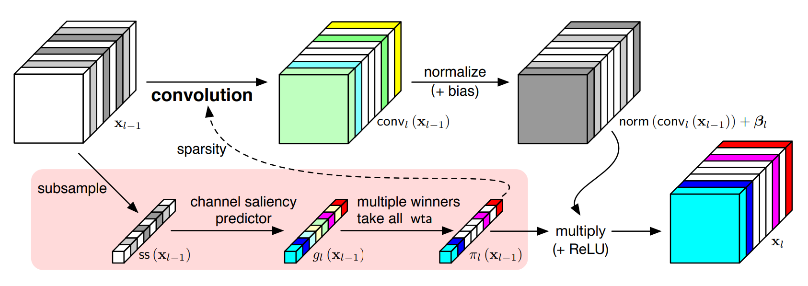

# PyTorch-FBS

A PyTorch Implementation of **Feature Boosting and Suppression**



## Paper

### Dynamic Channel Pruning: Feature Boosting and Suppression

ICLR 2019 • Xitong Gao • Yiren Zhao • Łukasz Dudziak • Robert Mullins • Cheng-zhong Xu | [arxiv](https://arxiv.org/abs/1810.05331)

Making deep convolutional neural networks more accurate typically comes at the cost of increased computational and memory resources. In this paper, we reduce this cost by exploiting the fact that the importance of features computed by convolutional layers is highly input-dependent, and propose feature boosting and suppression (FBS), a new method to predictively amplify salient convolutional channels and skip unimportant ones at run-time. FBS introduces small auxiliary connections to existing convolutional layers. In contrast to channel pruning methods which permanently remove channels, it preserves the full network structures and accelerates convolution by dynamically skipping unimportant input and output channels. FBS-augmented networks are trained with conventional stochastic gradient descent, making it readily available for many state-of-the-art CNNs. We compare FBS to a range of existing channel pruning and dynamic execution schemes and demonstrate large improvements on ImageNet classification. Experiments show that FBS can respectively provide 5× and 2× savings in compute on VGG-16 and ResNet-18, both with less than 0.6% top-5 accuracy loss.

## Usage

The most useful module is `models.ChannelPruning`, check it in `models/custom.py`. 

Use it like `nn.Sequential` and it will apply FBS algorithm on the submodules.  A `ChannelPruning` instance will take its input and predict channel saliency for its output, generate gate vector ($\pi_l$) using wta algorithm and multiply it with the output of submodules.

Use it to wrap your convolution blocks and rewrite your network. For example, I rewrite ResNet in `models/resnet.py` and trained it with `main.py`.

## Modification

Note that I did not fully follow the original algorithm. Instead, I did a little modification. Check this line in `models/custom.py`

``` python
t = t / torch.sum(t, dim=1).unsqueeze(1) * self.out_channels
```

You may try to comment it and retrain the network, and you are supposed to get NaN (not a number) very soon. I'm not totally sure about the reason. However, it turns out that this small modification doesn't reduce the algorithm's performance.

## Performance

I trained ResNet18 and ResNet34 on Imagenette and Imagewoof, both looks great. I haven't try other networks and datasets (such as ResNet50 and Imagenet) because I have nothing but a RTX2060.

## Citations

```
@misc{1810.05331,
  Author = {Xitong Gao and Yiren Zhao and Łukasz Dudziak and Robert Mullins and Cheng-zhong Xu},
  Title = {Dynamic Channel Pruning: Feature Boosting and Suppression},
  Year = {2018},
  Eprint = {arXiv:1810.05331},
}
```

## License

This repository is [Apache-licensed](LICENSE).